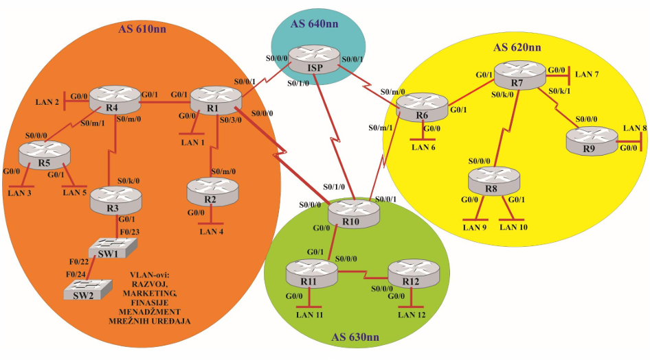
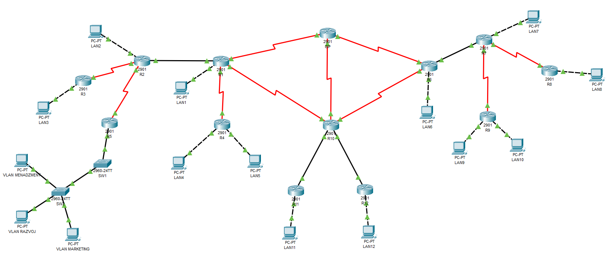

# Internet Architecture Project

This project is a comprehensive simulation of an Internet-like network architecture implemented using Cisco Packet Tracer. It involves routing, addressing, VLAN segmentation, and inter-AS communication.  
Goal was Implementation of a complete network topology in Cisco Packet Tracer with multiple Autonomous Systems (ASes), IPv4/IPv6 addressing, routing (static, OSPF, EIGRP, RIP, BGP), and VLAN configuration.

## Network Topology Overview

The view below shows the overall network topology of the project to be developed in Cisco Packet Tracer

This image shows the layout of the network in the project.

## 🔧 Tools & Technologies
- Cisco Packet Tracer
- Cisco 2901 Routers
- Cisco 2960 Switches
- IPv4 and IPv6 addressing
- Routing protocols: OSPF, EIGRP, RIP, BGP

## Network Design
- Autonomous Systems: AS 100nn, 200nn, 300nn, 400nn (ISP)
- IPv4 for all, IPv6 included only in AS 200nn
- VLANs for Development, Marketing, and Management
- Routing domains with internal and external routing protocols

## How to Run
1. Open `ai-project` using Cisco Packet Tracer
2. Verify routing tables and interfaces
3. Use CLI for testing connectivity (`ping`, `traceroute`, etc.)

## 📄 Documentation
Detailed explanation of addressing, routing configuration and design decisions can be found in [Documentation](doc/Documentation.md)  
Final report for this project can be found in [Report](doc/Report.pdf)
